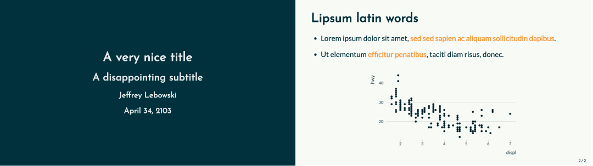

```{r setup, include=FALSE}
library(knitr)
opts_chunk$set(echo = FALSE, #set to false to hide code
               message = FALSE,
               warning = FALSE,
               out.width = "85%",
               dpi = 300,
               fig.align = "center") 
```

`medoiocrethemes` is a small R package providing ready to use ggplot themes that are, in my opinion, not strikingly nice but, hopefully, not strikingly ugly either (hence the name of the package). More info and vignettes to get familiar with the package can be found on the [package website](https://vincentbagilet.github.io/mediocrethemes/).

To me, the function `set_mediocre_all()` is the most useful feature of my package. When called at the beginning of the code, all subsequent graphs will be created using the new theme, without any additional line of code. This function enables users to easily depart from the nice but too often seen base ggplot theme and color scheme.

I tried my best to make my code reproducible. Users should be able to easily adapt my code to create their own theme and color scheme. The code for this package can be find on [the GitHub page of the package](https://github.com/vincentbagilet/mediocrethemes).

The base color palette is:

```{r}
library(ggplot2)
library(mediocrethemes)

set_mediocre_all()

ggplot(
  data = data.frame(x = 1:15, y = 1),
  aes(x, y, fill = factor(1:15))
) +
geom_tile() +
theme_void() +
theme(plot.margin = unit(c(-0.58,-0.9,-0.58,-0.9), "cm")) +
theme(legend.position="none") 
```


Here are a couple of example plots build using the theme and main color scale. A lot more graphs and color scales can be seen on the [package website](https://vincentbagilet.github.io/mediocrethemes/).

```{r}
ggplot(data = ggplot2::mpg, aes(x = cty, y = displ, fill = manufacturer)) +
    geom_col() +
    labs(title = "A very nice title", subtitle = "A disappointing subtitle")

ggplot(data = ggplot2::mpg, aes(x = cty, y = displ)) +
    geom_point() +
    labs(title = "A very nice title", subtitle = "A disappointing subtitle")
```

<!-- Several color palettes, inspired from [coolors](https://coolors.co/) are available, for instance: -->

<!-- ```{r} -->
<!-- qplot(x = 1:15, y = 1, fill = factor(1:15), geom = "tile") + -->
<!--   theme_void() + -->
<!--   scale_mediocre_d(pal = "coty") + -->
<!--   theme(plot.margin = unit(c(-0.58,-0.9,-0.58,-0.9), "cm")) + -->
<!--   theme(legend.position="none") -->
<!-- ``` -->

<!-- ```{r} -->
<!-- qplot(x = 1:15, y = 1, fill = factor(1:15), geom = "tile") + -->
<!--   theme_void() + -->
<!--   scale_mediocre_d(pal = "hotcold") + -->
<!--   theme(plot.margin = unit(c(-0.58,-0.9,-0.58,-0.9), "cm")) + -->
<!--   theme(legend.position="none") -->
<!-- ``` -->

I also created a [`xaringan`](https://github.com/yihui/xaringan) slide template in a style consistent with `mediocrethemes`:

```{r}

```

This is a simple an application of the [`xaringanthemer`](https://pkg.garrickadenbuie.com/xaringanthemer/) package and can be very easily set up with the function `mediocrethemes::xaringan_mediocre()`, as explained in [this vignette](https://vincentbagilet.github.io/mediocrethemes/articles/xaringan.html).


