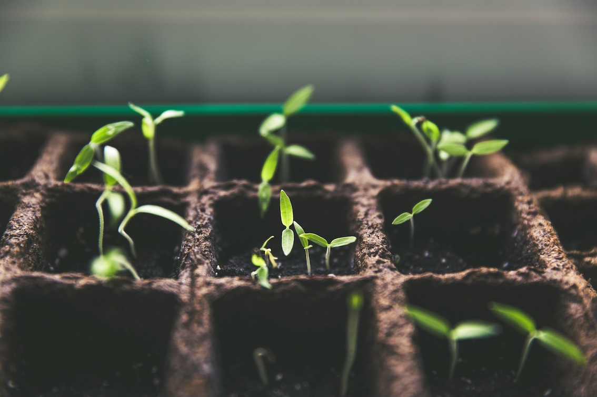

```{r setup, include=FALSE}
library(knitr)
opts_chunk$set(fig.path = "images/",
               cache.path = "cache/",
               cache = FALSE,
               echo = FALSE, #set to false to hide code
               message = FALSE,
               warning = FALSE,
               out.width = "100%",
               dpi = 200,
               fig.align = "center")  
```

## Current teaching at ENS de Lyon

:::: {style="display: flex; align-items: center; justify-content: space-between;"}

::: {.column width="40%"}
[{width=100% fig-alt="Planting seeds. Photo by Markus Spiske on Unsplash.com"}](https://vincentbagilet.github.io/env_econ_cpes/)
:::

::: {.column width="57%"}
[Empirical Environmental Economics](https://vincentbagilet.github.io/env_econ_cpes/) 

Undergrad level (L3), half course
:::
::::

:::: {style="display: flex; align-items: center; justify-content: space-between;"}
::: {.column width="40%"}
[{width=100% fig-alt="Simulations = repetition, reptetion. Photo by Nick Fewings on Unsplash.com"}](https://vincentbagilet.github.io/metrics_m2/)
:::

::: {.column width="57%"}
[Topics in Econometrics](https://vincentbagilet.github.io/metrics_m2/) 

Grad level (M2)

:::
::::

:::: {style="display: flex; align-items: center; justify-content: space-between;"}
::: {.column width="40%"}
[{width=100% fig-alt="Photo by Annie Spratt on Unsplash.com"}](https://vincentbagilet.github.io/tada_m2/)
:::

::: {.column width="57%"}
[Text as Data](https://vincentbagilet.github.io/tada_m2/)

Grad level (M2), module of the *Machine Learning and Big Data Analysis* course
:::
::::

## Past Teaching

### ENS de Lyon

- [Data Visualization for Economics Research](https://vincentbagilet.github.io/data_viz_summer/) (PhD level - Summer School lecture - 2025-2026)
- [Econometrics 1](https://vincentbagilet.github.io/metrics_m1_2024/) (Grad level - Half course - 2024)

### Columbia University (TA)

- Environmental Science for Sustainable Development (PhD level - 2021, 2022, 2023) 
- Microeconomics and Policy Analysis II (Grad level - 2022)
- Challenges of Sustainable Development (Undergrad level - 2021)
- Macroeconometrics (Grad level - 2020)
- Microeconomics and Policy Analysis I (Grad level - 2019, 2020) 


